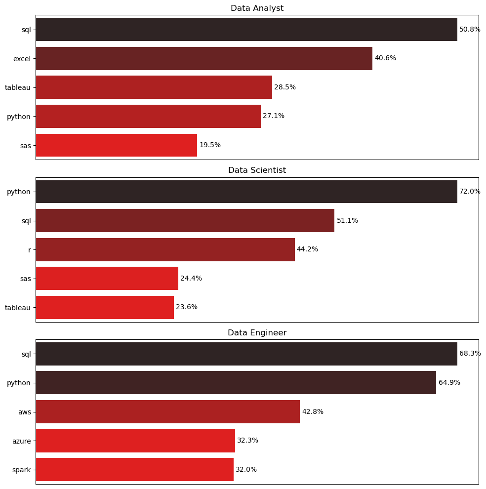

# Overview

Welcome to my analysis of the data job market, focusing on data analyst roles. This project was created out of a desire to navigate and understand the job market more effectively. It delves into the top-paying and in-demand skills to help find optimal job opportunities for data analysts.

The data sourced from [Luke Barousse's Python Course](https://lukebarousse.com/python) which provides a foundation for my analysis, containing detailed information on job titles, salaries, locations, and essential skills. Through a series of Python scripts, I explore key questions such as the most demanded skills, salary trends, and the intersection of demand and salary in data analytics.

# The Questions

Below are the questions I want to answer in my project:

1. What are the skills most in demand for the top 3 most popular data roles?
2. How are in-demand skills trending for Data Analysts?
3. How well do jobs and skills pay for Data Analysts?
4. What are the optimal skills for data analysts to learn? (High Demand AND High Paying) 

# Tools I Used

For my deep dive into the data analyst job market, I harnessed the power of several key tools:

- **Python:** The backbone of my analysis, allowing me to analyze the data and find critical insights.I also used the following Python libraries:
    - **Pandas Library:** This was used to analyze the data. 
    - **Matplotlib Library:** I visualized the data.
    - **Seaborn Library:** Helped me create more advanced visuals. 
- **Jupyter Notebooks:** The tool I used to run my Python scripts which let me easily include my notes and analysis.
- **Visual Studio Code:** My go-to for executing my Python scripts.
- **Git & GitHub:** Essential for version control and sharing my Python code and analysis, ensuring collaboration and project tracking.


# Data Preparation and Cleanup

This section outlines the steps taken to prepare the data for analysis, ensuring accuracy and usability.

## Import & Clean Up Data

I start by importing necessary libraries and loading the dataset, followed by initial data cleaning tasks to ensure data quality.

```python 
#importing libraries
import ast
import pandas as pd
import seaborn as sns
from datasets import load_dataset
from matplotlib import pyplot as plt
# Loading Data
dataset = load_dataset('lukebarousse/data_jobs')
df = dataset['train'].to_pandas()

# Data Cleanup
df['job_posted_date'] = pd.to_datetime(df['job_posted_date'])
df['month_name']=df['job_posted_date'].dt.month_name()
df['job_skills'] = df['job_skills'].apply(lambda x: ast.literal_eval(x) if pd.notna(x) else x)

```

## Filter US Jobs
To focus on US Job Market, I have used data of United States only. 
```python
df_US = df[df['job_country']=='United States'] 
```
## 1. What are the most demanded skills for the top 3 most popular data roles?

To find the most demanded skills for the top 3 most popular data roles. I filtered out those positions by which ones were the most popular, and got the top 5 skills for these top 3 roles. This query highlights the most popular job titles and their top skills, showing which skills I should pay attention to depending on the role I'm targeting. 

View my notebook with detailed steps here: [2_Skill_Demand](Project/2_Skill_Demand.ipynb).

### Visualize Data:
```python
fig , ax = plt.subplots(len(top_jobs),1 , figsize=(10,10))
for i , job in enumerate(top_jobs):
    df_chart = df_final_jobs[df_final_jobs['job_title_short']==job]
    df_chart = df_chart.sort_values(by='skill_count', ascending=False).head(5)
    barplot=sns.barplot(data=df_chart , x='Percentage_jobs', y='job_skills', hue='Percentage_jobs', palette='dark:r_r', ax=ax[i],legend=False)
    ax[i].set_title(job)
    ax[i].set_xlabel('')
    ax[i].set_ylabel('')

    # Add data labels to bars
    for container in barplot.containers:
        barplot.bar_label(container, fmt='%.1f%%', label_type='edge', padding=3)
    
    ax[i].set_xticks([])

fig.tight_layout()
```
### Results :


*Bar graph visualizing the salary for the top 3 data roles and their top 5 skills associated with each.*

## Insights From the Chart :
1) Data Analysts focus more on Excel/Tableau for reporting and dashboarding.

2) Data Scientists lean into Python, R, and statistics for modeling.

3) Data Engineers require cloud and big data expertise, in addition to strong programming and database knowledge.

### Role Specific :
#### Data Analyst
1) SQL (50.8%) is the most required skill, indicating a strong need for querying and managing databases.

2) Excel (40.6%) is still heavily used, reflecting reliance on spreadsheet-based analysis.

3) Tableau (28.5%) and Python (27.1%) are important for data visualization and scripting tasks.

4) SAS (19.5%) is the least demanded among the top 5, showing it’s still relevant but declining.

### Data Scientist
1) Python (72.0%) dominates, emphasizing its central role in data science workflows.

2) SQL (51.1%) remains critical, showing strong demand for data extraction skills.

3) R (44.2%) is uniquely significant here due to its statistical and modeling strengths.

4) SAS (24.4%) and Tableau (23.6%) have moderate importance, likely for legacy and reporting use.

### Data Engineer
1) SQL (68.3%) and Python (64.9%) are foundational, consistent with backend data manipulation.

2) AWS (42.8%), Azure (32.3%), and Spark (32.0%) highlight a strong shift toward cloud computing and big data frameworks.

3) Data Engineers are expected to manage infrastructure and pipelines, not just analysis.

## 2. How are in-demand skills trending for Data Analysts?

To find how skills are trending in 2023 for Data Analysts, I filtered data analyst positions and grouped the skills by the month of the job postings. This got me the top 5 skills of data analysts by month, showing how popular skills were throughout 2023.

View my notebook with detailed steps here: [3_Skills_Trend](Project/3_Skills_Trend.ipynb).

